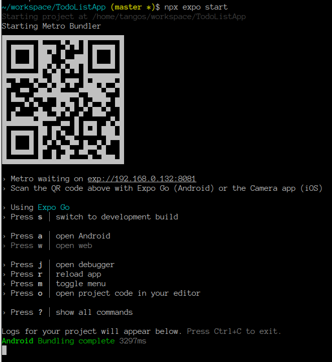

## 리액트 네이티브 (typescript) 따라하기

ChatGPT로 리액트 네이티브 타입스크립트로 TODO 리스트 앱 간단 예제를 처음부터 순서대로 알려달라고 했다.
https://chat.openai.com/share/8c52fdd6-4013-4c6d-ae7a-a14848722c8f

ChatGPT 무료버젼은 2021년까지 데이터만 참조하는 관계로 생성된 예제들은 의존성 문제로 그대로 적용하기가 어려웠다.
https://chat.openai.com/share/4171ad45-b47d-4536-bbc0-bc4164ad6fc8

그래서 기본 리액트 네이티브 타입스크립트 생성은 [리액트네이티브 사이트](https://reactnative.dev/docs/environment-setup?guide=quickstart&package-manager=npm)를 참조해서 생성 후,
 ChatGPT가 생성한 Todo.tsx 파일만 옮겼다.

모바일 폰에 Expo Go 앱 설치후, 프로젝트 파일에서 아래 명령을 실행하면, 로컬 웹서버가 시작하고, QA코드가 생성된다.  
```text
npx expo start
```



Android 폰에 Expo Go 앱 설치 후 QR코드를 스캔하거나 exp:// 주소를 직접 입력하면, 폰에서 바로 디버깅이 가능하다.
Android 폰이 없을 경우, 혹은 애뮬레이터로 개발을 원하면, expo 콘솔에서 Ctrl + a를 치면, 안드로이드 에뮬레이터가 동작한다.
이 방법은  Node, the React Native command line interface, a JDK, and Android Studio를 필요로 한다.


